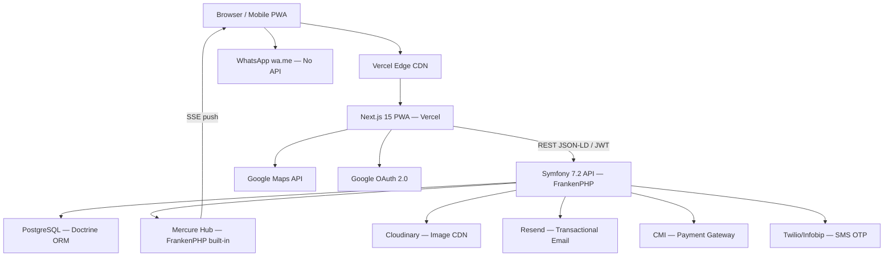
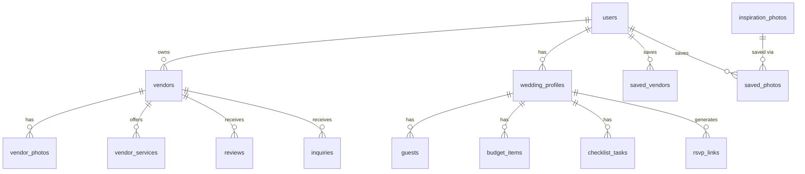
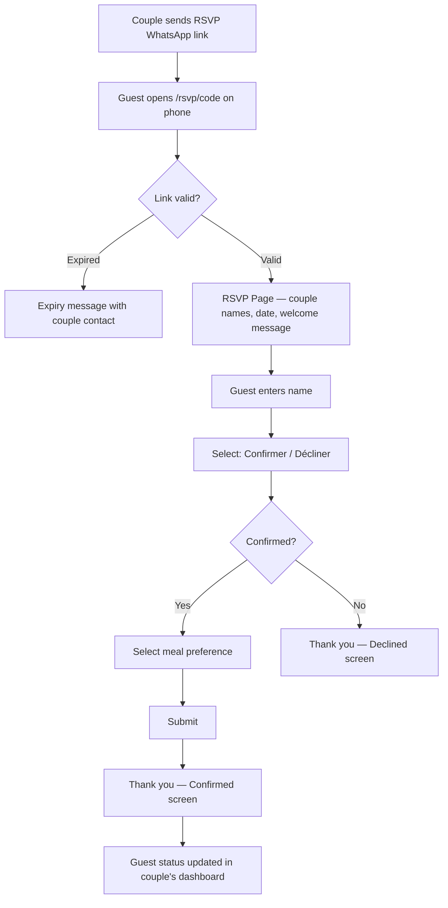
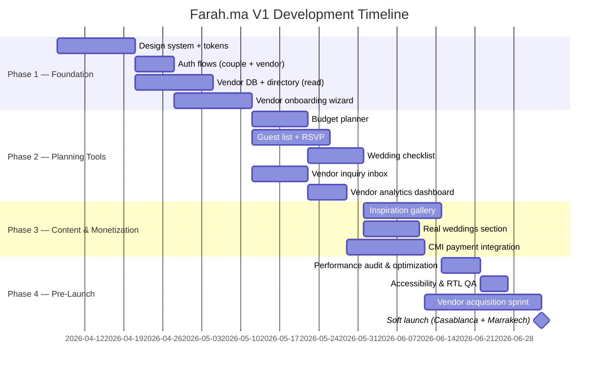

# Farah.ma — Product Requirements Document

> **Version:** 1.1
> **Date:** 2026-03-31
> **Author:** Product & Design Lead
> **Status:** Draft — Pending Client Review
> **Confidentiality:** Farah.ma — Confidential

---

## Table of Contents

1. [Executive Summary](#1-executive-summary)
2. [Problem Statement & Goals](#2-problem-statement--goals)
3. [User Personas & Stories](#3-user-personas--stories)
4. [Technical Architecture](#4-technical-architecture)
5. [UX/UI Specifications](#5-uxui-specifications)
6. [Success Metrics & Analytics](#6-success-metrics--analytics)
7. [Timeline & Milestones](#7-timeline--milestones)
8. [Resource Requirements](#8-resource-requirements)
9. [Open Questions & Assumptions](#9-open-questions--assumptions)
10. [Appendices](#10-appendices)

---

## 1. Executive Summary

Farah.ma (فرح — Arabic for "joy") is Morocco's first full-featured, deeply localized wedding planning platform. It connects engaged couples with verified local vendors across all Moroccan regions and provides a unified suite of planning tools — budget tracker, guest list manager, wedding checklist, and moodboard — in a single product. The platform operates in four languages (Darija, French, Modern Standard Arabic, and English) with native RTL layout support, all pricing in Moroccan Dirham (MAD), and vendor categories specific to Moroccan wedding culture (Négafa, Haïti, Amariya, Fanfara).

The market opportunity is clear: Moroccan couples currently plan their weddings across fragmented channels — Instagram DMs, WhatsApp groups, and word-of-mouth referrals — with no centralized source of truth for vendor discovery, pricing comparison, or planning coordination. Farah.ma solves this by offering an experience comparable to The Knot (US) or Zankyou (Europe) but built from the ground up for Morocco's cultural context, payment infrastructure (CMI gateway), and mobile-first user behavior.

The business model combines vendor subscription tiers (Free / Premium at 400 MAD/mo / Featured at 800 MAD/mo) with promoted listing fees, generating recurring revenue from a vendor base that benefits directly from increased couple discovery. V1 targets 500+ vendor listings at launch, 5,000 monthly active couples in Year 1, and a vendor inquiry conversion rate exceeding 5%. The primary success metric for V1 is **500 verified vendor listings live on launch day**.

---

## 2. Problem Statement & Goals

### 2.1 Problem Statement

Engaged couples in Morocco currently spend an estimated 20–30 hours coordinating vendor discovery across Instagram, WhatsApp, and word-of-mouth referrals — a process that yields no pricing transparency, no vendor reviews, and no single place to track what has been booked versus what is still pending. Families are coordinated through sprawling WhatsApp groups; budget overruns are common because there is no tool to track deposits and commitments in one place.

Simultaneously, Moroccan wedding vendors — venues, photographers, Négafas, caterers, and decorators — operate without a professional web presence. The vast majority have only an Instagram page and rely entirely on referrals for new business. They receive no analytics on how many couples viewed their profile, have no way to receive structured inquiries, and cannot differentiate their quality from unverified competitors.

The result is a market with high emotional stakes (a Moroccan wedding is one of the most significant family investments a household makes), significant spending (average Moroccan wedding budget: 80,000–200,000 MAD), and no digital infrastructure to support it.

### 2.2 Goals & Objectives

| # | Objective | Key Result | Baseline | Target | Timeline |
|---|-----------|------------|----------|--------|----------|
| G1 | Establish vendor supply at launch | Verified vendors live on platform | 0 | 500 | Launch day |
| G2 | Drive couple engagement | Monthly active couples using planning tools | 0 | 5,000 | Month 12 |
| G3 | Prove vendor ROI | Inquiry conversion rate (views → inquiry sent) | — | > 5% | Month 6 |
| G4 | Build mobile-first engagement | Share of traffic from mobile devices | — | > 70% | Month 3 |
| G5 | Establish content depth | Average session duration | — | > 8 min | Month 6 |
| G6 | Drive subscription revenue | Premium/Featured vendor subscription rate | 0% | > 20% of active vendors | Month 12 |

### 2.3 Non-Goals (Explicit Scope Boundaries)

The following are explicitly excluded from V1 scope:

- **Native iOS/Android app** — Web-first approach validates the market before native investment
- **In-platform live chat** — WhatsApp deep links (`wa.me`) are sufficient for V1 vendor-couple communication
- **Online booking with deposit payments** — Requires merchant escrow and legal complexity deferred to V2
- **AI-powered vendor recommendations** — Requires data volume not available at launch
- **Multi-vendor side-by-side comparison** — Deferred to V2
- **Drag-and-drop seating chart canvas** — List-based table assignment covers V1; canvas is a V2 feature
- **Wedding website builder for couples** — A separate product surface, targeted for V3
- **Admin moderation dashboard** — Manual moderation by a founder is sufficient for V1; V1.1 target
- **Algolia full-text search** — PostgreSQL full-text search covers V1 needs
- **WhatsApp Business API** — `wa.me` links require no API agreement and are sufficient for V1
- **Multi-language auto-translation of vendor content** — Machine translation quality requires validation before enabling

---

## 3. User Personas & Stories

### 3.1 User Personas

---

**Persona: Nadia — The Couple (Primary Planner)**
- **Demographics:** Female, 26, Casablanca. Engaged, wedding in 9 months. Works in finance. Mobile-first (WhatsApp, Instagram). Speaks Darija and French daily; Arabic and English occasionally.
- **Goals:** Find reliable vendors within a 120,000 MAD budget, keep family coordination organized, avoid losing track of deposits and deadlines.
- **Pain Points:** Cannot easily compare vendor pricing. Coordination is split across five WhatsApp groups. No clear record of what is booked vs. what is pending. Budget keeps shifting.
- **Technical Proficiency:** High — comfortable with apps and web, expects Airbnb/Booking.com-quality UX.

---

**Persona: Hassan — The Vendor (Small Business Owner)**
- **Demographics:** Male, 38, Marrakech. Runs a wedding photography studio. Has an Instagram page with 12,000 followers but no dedicated website. Responds to inquiries via WhatsApp.
- **Goals:** Be discovered by couples outside his existing network. Receive structured, qualified leads. Look professional online without managing complex software.
- **Pain Points:** No web presence beyond Instagram. Cannot track how many people see his work. Receives spam inquiries he cannot filter. Misses bookings because he cannot respond fast enough to informal DMs.
- **Technical Proficiency:** Medium — comfortable with smartphones and Instagram, less so with web dashboards.

---

**Persona: Amina — The Guest (Tertiary)**
- **Demographics:** Any age. Received an RSVP link via WhatsApp from a couple. No Farah.ma account.
- **Goals:** Confirm attendance and meal preference in under 60 seconds.
- **Pain Points:** Confused by multi-step forms. Reluctant to create an account just to RSVP.
- **Technical Proficiency:** Variable — must work for a non-technical user on a low-end Android phone.

---

### 3.2 User Stories & Requirements

#### Epic 1: Vendor Discovery & Directory

**US-1.1: Search Vendors by Category and City**
> As Nadia, I want to search for vendors by category and city so that I can quickly find qualified photographers in Casablanca.

| Priority | Effort Estimate | Dependencies |
|----------|----------------|--------------|
| P0 — Must Have | L | Vendor DB populated at launch |

**Acceptance Criteria:**
- [ ] Search bar on homepage accepts free-text and a city dropdown; on submit routes to `/vendors` with query params pre-filled
- [ ] Vendor directory page shows results filtered by category, city, price range, minimum rating, and verified status
- [ ] Filters apply instantly on desktop (no "Apply" button); on mobile, filters apply when user taps "Voir X résultats" in the bottom sheet
- [ ] Results display as cards (grid or list toggle) showing: cover photo, category badge, vendor name, city, star rating + count, price range, WhatsApp CTA
- [ ] Vendor count in each category filter updates to reflect active filter combinations
- [ ] Empty state shows a friendly message with a suggestion to broaden search criteria

---

**US-1.2: View Vendor Profile**
> As Nadia, I want to view a vendor's full profile so that I can evaluate their work, pricing, and reviews before contacting them.

| Priority | Effort Estimate | Dependencies |
|----------|----------------|--------------|
| P0 — Must Have | L | Vendor self-onboarding (US-2.1) |

**Acceptance Criteria:**
- [ ] Vendor detail page includes: photo gallery (lightbox on click), services & pricing table, about section, reviews with sub-ratings, map embed (city-level precision if vendor opts out of exact address), and a sticky WhatsApp contact bar on mobile
- [ ] "Contacter via WhatsApp" button opens `wa.me/[intlPhone]?text=[pre-filled message]` including vendor name and couple's wedding date if logged in
- [ ] Review section shows overall rating, sub-ratings (quality, communication, value, punctuality), and vendor reply if present
- [ ] Inquiry form (alternative to WhatsApp) captures: name, email, phone, wedding date, guest count, budget, message
- [ ] "Sauvegarder" heart button saves vendor to moodboard (optimistic UI — heart fills immediately)
- [ ] Page is indexable by Google with correct `<title>`, meta description, and `schema.org/LocalBusiness` structured data

---

**US-1.3: Save Vendors to Moodboard**
> As Nadia, I want to save vendors I like to a moodboard so that I can review my shortlist later without re-searching.

| Priority | Effort Estimate | Dependencies |
|----------|----------------|--------------|
| P1 — Should Have | S | Authentication (US-3.1) |

**Acceptance Criteria:**
- [ ] Save action available on vendor cards (directory) and vendor profile pages
- [ ] Saved vendors appear in `/plan/saved` with the same card layout as the directory
- [ ] Unsaving a vendor shows a confirmation toast; removes from saved list immediately
- [ ] Save count persists across sessions for authenticated users

---

#### Epic 2: Vendor Onboarding & Dashboard

**US-2.1: Vendor Profile Setup**
> As Hassan, I want to create and complete my vendor profile so that couples can discover my business on Farah.ma.

| Priority | Effort Estimate | Dependencies |
|----------|----------------|--------------|
| P0 — Must Have | XL | Supabase Auth, Cloudinary |

**Acceptance Criteria:**
- [ ] Vendor registration flow collects: business name, category, cities served, WhatsApp number, and at least one cover photo — minimum viable profile to go live
- [ ] Full profile supports: description (rich text, max 1,000 chars), services table (name, description, price min/max), up to 5 photos on Free tier / 30 on Premium/Featured, Instagram and Facebook links
- [ ] Profile completeness indicator (percentage bar) visible in dashboard header with specific suggestions for each incomplete field
- [ ] Profile setup can be completed in under 10 minutes for a vendor with photos already on their phone
- [ ] Profile goes into "pending review" status on submit; visible to the vendor but not publicly indexed until admin approves
- [ ] Vendor receives an email confirmation via Resend on approval

---

**US-2.2: Inquiry Inbox**
> As Hassan, I want to view and respond to couple inquiries so that I can convert leads into bookings.

| Priority | Effort Estimate | Dependencies |
|----------|----------------|--------------|
| P0 — Must Have | M | Vendor profile (US-2.1) |

**Acceptance Criteria:**
- [ ] Inquiry inbox shows all received inquiries with status badges: New / Read / Replied
- [ ] Each inquiry detail shows: couple name, email, phone, wedding date, guest count, budget, message, and timestamp
- [ ] "Répondre via WhatsApp" button pre-fills a WhatsApp message to the couple's phone
- [ ] Free tier vendors see a "0 of 5 inquiries remaining this month" indicator; at limit, inquiry form on their profile is hidden and replaced with an upgrade prompt
- [ ] New inquiry triggers an email notification to the vendor's registered email via Resend

---

**US-2.3: Vendor Analytics**
> As Hassan, I want to see how many couples are viewing and saving my profile so that I can understand my visibility and justify upgrading my subscription.

| Priority | Effort Estimate | Dependencies |
|----------|----------------|--------------|
| P1 — Should Have | M | Vendor profile live (US-2.1) |

**Acceptance Criteria:**
- [ ] Free tier: profile view count displayed as a single number (last 30 days)
- [ ] Premium/Featured: full analytics dashboard showing views, clicks, saves, inquiry count, and inquiry rate as a line chart (last 30 / 90 days toggle)
- [ ] Analytics data updates daily (not real-time)
- [ ] Upgrade prompt is shown inline within the analytics section for Free tier vendors

---

#### Epic 3: Couple Planning Tools

**US-3.1: Account Registration & Login**
> As Nadia, I want to create an account so that my planning data is saved and accessible from any device.

| Priority | Effort Estimate | Dependencies |
|----------|----------------|--------------|
| P0 — Must Have | M | Symfony Security, lexik JWT, Google OAuth |

**Acceptance Criteria:**
- [ ] Signup supports: email + password, and Google OAuth
- [ ] Email verification required before accessing planning tools
- [ ] Login supports email/password and Google SSO
- [ ] Password reset flow sends a reset link via Resend
- [ ] On first login, couple is prompted to set their wedding date and estimated budget (skippable)
- [ ] Auth state persists via lexik JWT stored in an HTTP-only cookie; silent refresh via the refresh token endpoint

---

**US-3.2: Budget Planner**
> As Nadia, I want to track my wedding budget by category so that I know exactly how much I have spent and how much remains.

| Priority | Effort Estimate | Dependencies |
|----------|----------------|--------------|
| P0 — Must Have | L | Authentication (US-3.1) |

**Acceptance Criteria:**
- [ ] Budget overview shows: total budget (editable), total spent, total remaining, and percentage used
- [ ] Donut chart visualizes spend by category (Recharts)
- [ ] Default categories pre-populated: Salle de Fête, Photographe, Traiteur, Négafa, Décoration, DJ, Transport, Robe, Fleurs, Divers
- [ ] Each category row shows: budgeted amount, spent amount, remaining amount; over-budget rows highlighted in `--color-warning-bg`
- [ ] Inline editing of budgeted and spent amounts per category with immediate recalculation
- [ ] Add/remove custom budget categories
- [ ] All amounts in MAD; dual-handle budget slider uses 500 MAD steps

---

**US-3.3: Guest List Manager**
> As Nadia, I want to manage my guest list and send RSVP links so that I can track attendance without using WhatsApp groups.

| Priority | Effort Estimate | Dependencies |
|----------|----------------|--------------|
| P0 — Must Have | L | Authentication (US-3.1) |

**Acceptance Criteria:**
- [ ] Add guests individually (name, phone, email, side: bride/groom/both, relationship, city) or via CSV import
- [ ] Guest list shows RSVP status badges: Pending / Confirmed / Declined with color coding
- [ ] Meal preference tracked per guest: Standard / Végétarien / Enfants
- [ ] Generate a unique RSVP link (`/rsvp/[code]`) per event; link can be shared via WhatsApp (pre-filled `wa.me` URL)
- [ ] RSVP summary dashboard: total invited, confirmed count, declined count, pending count, meal preference breakdown
- [ ] Table assignment: integer field per guest, sortable by table number; export to CSV

---

**US-3.4: Wedding Checklist**
> As Nadia, I want a pre-built wedding checklist adapted to Moroccan wedding timelines so that I don't miss any preparation steps.

| Priority | Effort Estimate | Dependencies |
|----------|----------------|--------------|
| P0 — Must Have | M | Authentication (US-3.1) |

**Acceptance Criteria:**
- [ ] Default checklist pre-populated with 40+ tasks organized by months-before-wedding (12 months → 1 month → week-of)
- [ ] Tasks grouped by category: Salle, Traiteur, Photographe, Négafa, Tenue, Invitations, Beauté, Lune de Miel, Administratif
- [ ] Each task: name, due date (auto-calculated from wedding date), status (To Do / In Progress / Done), assignee field (free text), notes, and optional linked vendor
- [ ] Tasks reorderable via drag-and-drop (implement with a DnD library compatible with React 19; evaluate `@dnd-kit/core` or HTML5 drag API)
- [ ] Overdue tasks highlighted in `--color-warning-bg`; overdue count shown in checklist header
- [ ] Couples can add custom tasks; default tasks cannot be deleted but can be marked N/A
- [ ] Progress bar at top of checklist: X of Y tasks completed

---

**US-3.5: Guest RSVP Page**
> As Amina (a guest), I want to confirm my attendance from a WhatsApp link without creating an account so that I can RSVP in under 60 seconds.

| Priority | Effort Estimate | Dependencies |
|----------|----------------|--------------|
| P0 — Must Have | S | Guest list (US-3.3), rsvp_links table |

**Acceptance Criteria:**
- [ ] RSVP page loads in under 1.5 seconds on simulated 4G
- [ ] No login or account creation required
- [ ] Page shows couple names, wedding date, and a warm welcome message
- [ ] Guest enters their name (or selects from a pre-populated list if their name was added), selects attendance (Confirmer / Décliner), and optionally selects meal preference
- [ ] Confirmation screen shown immediately after submit with a thank-you message in the couple's primary language
- [ ] Expired RSVP links show a friendly expiry message, not a 404

---

#### Epic 4: Inspiration Gallery

**US-4.1: Browse & Save Inspiration Photos**
> As Nadia, I want to browse Moroccan wedding photos filtered by style and region so that I can build a visual moodboard for my wedding.

| Priority | Effort Estimate | Dependencies |
|----------|----------------|--------------|
| P1 — Should Have | M | Cloudinary, Authentication for saves |

**Acceptance Criteria:**
- [ ] Inspiration gallery at `/inspiration` shows photos in a masonry grid (3-column desktop, 2-column mobile)
- [ ] Filter by: style (Traditional, Modern, Bohème, Andalou), region, elements (Caftan, Fanfara, Zellige, Lanterns)
- [ ] Hovering a photo reveals a save-to-moodboard heart icon and the style tag
- [ ] Clicking a photo opens a lightbox/modal (URL updates to `/inspiration/[id]` for shareability)
- [ ] Saved photos appear alongside saved vendors in `/plan/saved`
- [ ] Photos are approved by admin before appearing publicly (approved boolean in DB)

---

### 3.3 Requirements Traceability Matrix

| Req ID | Description | Goal | Priority | Status |
|--------|-------------|------|----------|--------|
| US-1.1 | Vendor search by category & city | G2, G3 | P0 | Proposed |
| US-1.2 | Vendor detail page & profile | G3, G4 | P0 | Proposed |
| US-1.3 | Save vendors to moodboard | G2, G5 | P1 | Proposed |
| US-2.1 | Vendor profile setup | G1, G6 | P0 | Proposed |
| US-2.2 | Inquiry inbox | G3, G6 | P0 | Proposed |
| US-2.3 | Vendor analytics dashboard | G6 | P1 | Proposed |
| US-3.1 | Couple account registration & login | G2 | P0 | Proposed |
| US-3.2 | Budget planner | G2, G5 | P0 | Proposed |
| US-3.3 | Guest list manager | G2, G5 | P0 | Proposed |
| US-3.4 | Wedding checklist | G2, G5 | P0 | Proposed |
| US-3.5 | Guest RSVP page | G4 | P0 | Proposed |
| US-4.1 | Inspiration gallery | G2, G5 | P1 | Proposed |

---

## 4. Technical Architecture

### 4.1 System Overview

Farah.ma uses a **decoupled API + PWA** architecture. The backend is a Symfony 7.2 application running on FrankenPHP, exposing a hypermedia REST API built with API Platform 4.2. The frontend is a Next.js 15 PWA (React 19, TypeScript) that consumes this API exclusively — there are no Next.js API routes; all business logic lives in Symfony. PostgreSQL is the primary database, managed via Doctrine ORM and Doctrine Migrations. Authentication uses JWT issued by `lexik/jwt-authentication-bundle`. Real-time push events (new inquiry notifications, RSVP updates) are delivered via a Mercure hub embedded in the FrankenPHP runtime. Cloudinary handles all image storage and delivery.



The architectural rationale: separating the API from the frontend gives the backend a clean contract boundary, makes the API independently testable and versioned, and positions V2 native apps (iOS/Android) to consume the same API without any backend changes. FrankenPHP eliminates the PHP-FPM + Nginx layer — the runtime serves HTTP/2, HTTP/3, and Mercure from a single binary, which simplifies deployment and reduces infrastructure overhead. The Next.js frontend handles SSR for SEO-critical public pages (homepage, vendor directory, vendor profiles) and CSR for authenticated planning tools.

### 4.2 Component Architecture

**Component: Symfony API Backend**
- **Responsibility:** All business logic, data persistence, authentication, authorization, email delivery, payment webhook processing, real-time event publishing
- **Technology:** PHP 8.4, Symfony 7.2, API Platform 4.2, Doctrine ORM, `lexik/jwt-authentication-bundle`, `symfony/mercure-bundle`, Symfony Mailer, Symfony Security, Symfony Validator
- **Runtime:** `runtime/frankenphp-symfony` — serves HTTP/1.1, HTTP/2, HTTP/3 and the Mercure hub from a single FrankenPHP binary. No separate Nginx or PHP-FPM process required.
- **Interfaces:** JSON-LD / Hydra REST API consumed by the Next.js frontend; Mercure SSE hub consumed by browser clients; CMI webhook receiver at `POST /api/webhooks/cmi`
- **Data Store:** PostgreSQL (Doctrine ORM + Doctrine Migrations for schema management)
- **Scaling Strategy:** Horizontal scaling via Docker replicas behind a load balancer. Doctrine second-level cache (Redis) added in V2 if query volume warrants it.

**Component: Next.js PWA Frontend**
- **Responsibility:** Rendering (SSR for public/SEO pages, CSR for planning tools), client-side routing, i18n, forms, real-time UI updates via Mercure EventSource
- **Technology:** Next.js 15 (App Router), React 19, TypeScript, Tailwind CSS 4.1, Radix UI primitives, `lucide-react`, `@tanstack/react-query`, `next-i18next` / `react-i18next`, Formik + Yup, `@api-platform/admin` (admin panel)
- **Interfaces:** Symfony API (REST/JSON-LD over HTTPS), Mercure SSE hub, Google Maps JS API, Google OAuth 2.0 redirect flow
- **Data Store:** No server-side persistence. TanStack Query handles all remote state, caching, and optimistic updates. Client-side language preference stored in `localStorage`.
- **Scaling Strategy:** Serverless via Vercel; static assets served from Vercel Edge CDN.

**Component: PostgreSQL + Doctrine ORM**
- **Responsibility:** Primary relational data store; schema managed exclusively via Doctrine Migrations
- **Technology:** PostgreSQL 15, Doctrine ORM 3.x, Doctrine Migrations
- **Interfaces:** Accessed only by the Symfony backend — never directly from the frontend
- **Data Store:** All application entities (see Section 4.3)
- **Scaling Strategy:** Connection pooling via PgBouncer; read replica evaluated at V2

**Component: Mercure Hub (Real-time)**
- **Responsibility:** Push server-sent events to authenticated browser clients — new inquiry notifications to vendors, RSVP status updates to couples
- **Technology:** Mercure protocol, built into the FrankenPHP runtime via `symfony/mercure-bundle`
- **Interfaces:** Symfony publishes `Update` objects; browser clients subscribe via `EventSource` using a JWT-scoped Mercure cookie
- **Scaling Strategy:** Embedded hub handles V1 volume; external Mercure hub (e.g., Mercure.rocks managed) available if horizontal scaling of the backend is needed

**Component: Cloudinary**
- **Responsibility:** Vendor photo upload, storage, WebP conversion, responsive srcset generation, thumbnail resizing
- **Technology:** Cloudinary Media Library, transformation URL API
- **Interfaces:** Cloudinary Upload Widget (client-side direct upload with Symfony-signed upload preset); Cloudinary PHP SDK (server-side for signed URL generation and webhook handling)
- **Data Store:** All user-uploaded images; Cloudinary public IDs stored in `vendor_photos.cloudinary_id`
- **Scaling Strategy:** Cloudinary handles CDN and scaling automatically

**Component: CMI Payment Integration**
- **Responsibility:** Processing vendor subscription payments in MAD
- **Technology:** CMI REST API, webhook for payment confirmation
- **Interfaces:** Redirect-based checkout initiated by Symfony; webhook receiver at `POST /api/webhooks/cmi` with CMI signature verification via Symfony event listener
- **Data Store:** Subscription status in `vendors.subscription_tier`; full transaction log in a `subscriptions` table [TBD — confirm schema with CMI API docs]
- **Scaling Strategy:** Stateless Symfony controller; idempotency enforced via CMI payment reference ID stored in DB

### 4.3 Data Model



**Key entities:**

- **users** — Unified auth entity for couples, vendors, and admins. `role` enum distinguishes user types. Credentials managed by Symfony Security with passwords hashed via `sodium` or `bcrypt`. JWT tokens issued by `lexik/jwt-authentication-bundle` on successful login.
- **vendors** — The core public-facing entity. `subscription_tier` controls feature access. `avg_rating` and `review_count` are denormalized fields maintained by a Doctrine event listener (`PostPersist` / `PostUpdate` on `Review`) that recalculates and persists the aggregates.
- **wedding_profiles** — The couple's planning workspace. One couple user has one wedding profile in V1. `wedding_date` drives all checklist task due date calculations.
- **guests** — Belongs to a `wedding_profile`. `rsvp_status` is updated when the guest submits the RSVP page. `meal_preference` stored as a PHP-backed enum.
- **checklist_tasks** — Pre-seeded with 40+ default tasks (`is_default: true`) via a Doctrine data fixture. Custom tasks created by the couple use `is_default: false`. `months_before` is used to auto-calculate `due_date` when a couple sets their `wedding_date`.
- **rsvp_links** — Unique token-based links. `code` is a UUID-derived short token. `expires_at` is optional; if null, the link is permanent.

### 4.4 API Design

The API is built with **API Platform 4.2**, which auto-generates JSON-LD / Hydra-compliant endpoints from Doctrine entity annotations. Custom business logic (inquiry limits, subscription checks, RSVP token validation) is implemented as API Platform state processors and providers. All endpoints live under the `/api/` prefix.

Authentication uses **JWT Bearer tokens** issued by `lexik/jwt-authentication-bundle`. Tokens expire after 1 hour; a refresh token endpoint extends sessions. Public endpoints (vendor directory, vendor profiles, RSVP page) require no token. Authorization is enforced at the Symfony Security layer via Voters — vendors may only modify their own resources; couples may only access their own `wedding_profile`.

| Method | Endpoint | Description | Auth |
|--------|----------|-------------|------|
| GET | /api/vendors | List vendors (filterable, paginated) | Public |
| GET | /api/vendors/{slug} | Get vendor profile | Public |
| POST | /api/vendors | Create vendor | Bearer — vendor role |
| PATCH | /api/vendors/{id} | Update vendor | Bearer — owner Voter |
| POST | /api/inquiries | Submit inquiry to vendor | Public (name + email required) |
| GET | /api/inquiries | Get vendor's inquiries | Bearer — vendor role |
| PATCH | /api/inquiries/{id} | Update inquiry status | Bearer — vendor owner Voter |
| GET | /api/wedding-profiles/{id}/budget-items | Get couple's budget | Bearer — couple owner |
| PATCH | /api/budget-items/{id} | Update budget item | Bearer — couple owner Voter |
| GET | /api/wedding-profiles/{id}/guests | Get guest list | Bearer — couple owner |
| POST | /api/guests | Add guest | Bearer — couple role |
| PATCH | /api/guests/{id} | Update guest / RSVP status | Bearer or RSVP token |
| GET | /api/rsvp/{code} | Get RSVP page data | Public — token auth |
| POST | /api/rsvp/{code}/respond | Submit RSVP response | Public — token auth |
| POST | /api/auth/login | Issue JWT + refresh token | Public |
| POST | /api/auth/refresh | Refresh JWT | Refresh token |
| POST | /api/auth/google | Exchange Google OAuth code for JWT | Public |
| POST | /api/webhooks/cmi | CMI payment webhook | CMI HMAC signature |

**API Platform filtering on `GET /api/vendors`** uses built-in `#[ApiFilter]` annotations:
- `SearchFilter` on `category`, `citiesServed`, `businessName`
- `RangeFilter` on `priceRangeMin`, `priceRangeMax`, `avgRating`
- `BooleanFilter` on `verified`, `featured`
- `OrderFilter` on `avgRating`, `reviewCount`, `createdAt`

**Critical request schemas:**

`POST /api/inquiries` request body (JSON-LD):
```json
{
  "vendor": "/api/vendors/uuid",
  "name": "string",
  "email": "string",
  "phone": "+212XXXXXXXXX",
  "weddingDate": "YYYY-MM-DD",
  "guestCount": 150,
  "budgetMad": 120000,
  "message": "string (min 20 chars)"
}
```

`POST /api/rsvp/{code}/respond` request body:
```json
{
  "guestName": "string",
  "rsvpStatus": "confirmed | declined",
  "mealPreference": "standard | vegetarian | children"
}
```

### 4.5 Integration Points

| System | Integration Type | Protocol | Data Flow |
|--------|-----------------|----------|-----------|
| PostgreSQL / Doctrine ORM | ORM (Doctrine) | Internal | Bidirectional |
| Mercure Hub (FrankenPHP) | SSE | HTTP/2 | Out (Symfony publishes updates), In (browser subscribes) |
| Cloudinary | PHP SDK + Webhook | HTTPS | Out (signed upload URL), In (webhook on processing complete) |
| Google OAuth 2.0 | OAuth 2.0 redirect | HTTPS | In (user identity → Symfony issues JWT) |
| Google Maps API | REST (JS client) | HTTPS | In (map tiles, city autocomplete — called from Next.js) |
| Resend | REST API via Symfony Mailer | HTTPS | Out (transactional email) |
| CMI | Redirect + Webhook | HTTPS | Out (payment redirect from Symfony), In (confirmation webhook to Symfony) |
| WhatsApp wa.me | Deep link (no API) | URL scheme | Out (opens WhatsApp app — built in Next.js) |
| Twilio/Infobip | REST from Symfony | HTTPS | Out (SMS OTP for password reset) |
| Google Analytics 4 | JS snippet (Next.js) | HTTPS | Out (event tracking) |
| Sentry | JS SDK (Next.js) + PHP SDK (Symfony) | HTTPS | Out (frontend + backend error reporting) |

### 4.6 Infrastructure & Deployment

- **Backend hosting:** Docker container running FrankenPHP (includes PHP 8.4 + Caddy + Mercure hub in a single binary). Deployed to a VPS or container platform (e.g., Railway, Fly.io, or a dedicated VPS with Docker Compose). Primary region: Europe West — lowest latency to Morocco.
- **Frontend hosting:** Vercel. Primary region: `fra1` (Frankfurt). Vercel Edge Network serves static assets and SSR responses globally.
- **CI/CD:** GitHub Actions runs on every pull request — backend: `composer validate`, PHPStan static analysis, PHPUnit tests, Doctrine schema validation; frontend: ESLint + TypeScript type-check + Next.js build. Merges to `main` trigger production deployments to both Vercel (frontend) and the container host (backend) via separate pipelines.
- **Environments:** `development` (Docker Compose locally — FrankenPHP + PostgreSQL) → `preview` (Vercel preview + staging backend container) → `production`
- **Monitoring:** Sentry PHP SDK for backend error tracking; Sentry JS SDK for frontend. Google Search Console for Core Web Vitals. Symfony Monolog → structured logs shipped to a log aggregator (e.g., Papertrail or Logtail).
- **Database migrations:** Doctrine Migrations run as a one-off command (`php bin/console doctrine:migrations:migrate`) in the CI/CD pipeline before the new container starts. Migrations are always backward-compatible to allow zero-downtime deploys.
- **Disaster Recovery:** PostgreSQL daily automated backups via `pg_dump` to an S3-compatible bucket (e.g., Cloudflare R2). RPO target: 24 hours. RTO target: 4 hours. Cloudinary retains original uploads indefinitely.

### 4.7 Security Considerations

- **Authentication:** `lexik/jwt-authentication-bundle` issues RS256-signed JWTs on login. Tokens expire after 1 hour. A refresh token (stored as an HTTP-only cookie) allows silent renewal without re-login. Google OAuth 2.0 for social login — Symfony exchanges the OAuth code for a user identity and issues its own JWT (scope: email + profile only).
- **Authorization:** Symfony Security Voters enforce resource-level access control — a vendor may only modify their own `Vendor` entity; a couple may only access their own `WeddingProfile`. API Platform's `security` attribute on operations provides endpoint-level role checks (`ROLE_VENDOR`, `ROLE_COUPLE`). No reliance on database-level row filtering.
- **Data Protection:** All data encrypted at rest (database host default AES-256). All traffic over HTTPS (FrankenPHP + Caddy automatic TLS via Let's Encrypt; Vercel automatic SSL). Passwords hashed with `sodium` (Symfony Security default for PHP 8.x). Phone numbers stored as plain text — PII handling policy [TBD — confirm with legal counsel].
- **Input Validation:** Symfony Validator (`symfony/validator`) validates all API request bodies via Doctrine entity constraints and dedicated DTO validation groups. API Platform applies Symfony Validator automatically before any state processor runs. SQL injection is prevented by Doctrine's parameterized DQL/QueryBuilder. XSS is prevented by React's default escaping (frontend) and Tiptap's output sanitization.
- **CORS:** Symfony `nelmio/cors-bundle` configured to allow requests only from `farah.ma` and Vercel preview domains. All other origins receive a 403.
- **RSVP Link Security:** RSVP tokens are UUID-derived (128-bit entropy). Expired tokens return a `410 Gone` response from the Symfony state provider, not a 404.
- **Mercure Security:** Mercure subscriber JWT is issued by Symfony with a topic claim scoped to the subscriber's own resources (e.g., `/vendors/{id}/inquiries`). Subscribers cannot listen to other users' topics.
- **Payment Security:** No card data stored on Farah.ma servers. CMI handles PCI-DSS compliance. CMI webhook signature verified using HMAC-SHA256 in the Symfony event listener before any state change is applied.
- **Compliance:** CNDP notification required before launch. Cookie consent banner required; GA4 initialized only after user accepts. Invoice generation (Facture) for every CMI transaction required by Moroccan tax regulations — generated via Twig PDF template and emailed via Symfony Mailer.

### 4.8 Performance Requirements

| Metric | Target | Measurement Method |
|--------|--------|--------------------|
| Lighthouse Performance Score (mobile) | > 85 | Google Lighthouse CI on every deploy |
| Largest Contentful Paint (LCP) | < 2.5s | Core Web Vitals (Search Console) |
| First Contentful Paint (FCP) | < 1.5s | Core Web Vitals |
| Cumulative Layout Shift (CLS) | < 0.1 | Core Web Vitals |
| Time to Interactive (TTI) | < 3.5s on simulated 4G | Lighthouse |
| Vendor directory API response (12 results) | < 600ms | Symfony Profiler + PostgreSQL slow query log |
| RSVP page total load time | < 1.5s | Lighthouse + RUM |
| Vendor thumbnail images | < 80KB | Cloudinary auto-quality |
| Vendor gallery images | < 250KB | Cloudinary auto-quality |
| Hero image | < 400KB | Cloudinary auto-quality |
| Uptime SLA | 99.9% | UptimeRobot or Better Uptime — monitors both backend and Vercel |

**Database indexes required at launch:**
- `vendors(category)`, `vendors(cities_served)`, `vendors(subscription_tier)`, `vendors(avg_rating)`
- `reviews(vendor_id)`, `inquiries(vendor_id, status)`, `guests(wedding_profile_id, rsvp_status)`
- Full-text index on `vendors(business_name, description)` for PostgreSQL FTS search

---

## 5. UX/UI Specifications

### 5.1 Design Philosophy

Version 3.0 adopts a **white-first, single-accent** design language inspired by Airbnb — pure white surfaces, a single bold terracotta accent (`#E8472A`), generous spacing, and rounded cards (24px radius) — while preserving Moroccan cultural identity through typography, color choice, and geometric pattern details used sparingly in five specific placements.

**Core design principles:**
- **White-first surfaces** — Every page starts from pure white. Color signals meaning, not decoration.
- **One accent, with discipline** — Terracotta (`#E8472A`) appears only on the most important action on any screen. Never decorative.
- **Moroccan identity through type** — DM Serif Display (Latin headlines) + Tajawal Bold (Arabic headlines) + Plus Jakarta Sans (all UI and body) across all four languages.
- **Depth through shadow** — Cards elevate on hover via a shadow upgrade (`shadow-1` → `shadow-2`) and a 2px Y-translate, not via color change.
- **Cultural motifs in five places only** — Hero section background texture, section ornament dividers, category tile background pattern, logo mark, and Real Weddings article header border. Everywhere else: clean and neutral.

### 5.2 User Flows

**Primary flow — Couple vendor discovery:**

```mermaid
flowchart TD
    A[Homepage] --> B{Has Account?}
    B -- No --> C[Search Vendors — no login required]
    B -- Yes --> D[Personalized Homepage — shows wedding date]
    C --> E[Vendor Directory — filtered results]
    D --> E
    E --> F[Vendor Profile Page]
    F --> G{Contact Method}
    G -- WhatsApp --> H[Opens WhatsApp App — pre-filled message]
    G -- Inquiry Form --> I[Submit Inquiry Form]
    I --> J[Email Confirmation to Couple + Vendor notification]
    F --> K[Save to Moodboard]
    K --> L[/plan/saved — Saved Vendors]
```

**Primary flow — Vendor onboarding:**

```mermaid
flowchart TD
    A[/for-vendors landing page] --> B[Click Référencer mon entreprise]
    B --> C[Vendor Registration — email + password]
    C --> D[Email Verification]
    D --> E[Profile Setup Wizard — Step 1: Basic Info]
    E --> F[Step 2: Photos Upload — minimum 1 cover]
    F --> G[Step 3: Services & Pricing]
    G --> H[Profile Preview]
    H --> I[Submit for Review]
    I --> J[Admin Review — pending state]
    J --> K[Approved — Profile Live]
    K --> L[Vendor Dashboard — Inquiry Inbox]
```

**RSVP flow:**



### 5.3 Wireframe Descriptions

**Screen: Vendor Directory (/vendors)**
- **Purpose:** Search, filter, and browse all vendor listings
- **Key Elements:** Left filter sidebar (desktop) / bottom-sheet drawer (mobile), sort dropdown, grid/list toggle, vendor result cards, pagination or infinite scroll
- **Actions Available:** Apply filters, change sort order, toggle grid/list view, save vendor, click vendor card to navigate to profile, submit WhatsApp inquiry directly from card
- **Navigation:** From homepage search bar → `/vendors?category=photographe&city=casablanca`; links back to homepage; clicking a card navigates to `/vendors/[slug]`

**Screen: Vendor Detail Page (/vendors/[slug])**
- **Purpose:** Full vendor evaluation before contact
- **Key Elements:** Hero photo (full-width), photo gallery (masonry, 3-col), quick stats bar (rating, response time, verified badge, city), about section, services table, reviews with sub-rating bars, map embed, inquiry form, sticky WhatsApp CTA (mobile)
- **Actions Available:** Contact via WhatsApp, submit inquiry form, save to moodboard, navigate photo gallery, read reviews, see map location
- **Navigation:** Back to `/vendors` via breadcrumb; related vendors section at bottom (same category + city)

**Screen: Budget Planner (/plan/budget)**
- **Purpose:** Track wedding budget by category
- **Key Elements:** Total budget header (editable), donut chart (Recharts), category rows table (budgeted / spent / remaining), over-budget warnings, "Add category" button
- **Actions Available:** Edit total budget, edit per-category budgeted and spent amounts, add custom category, view percentage breakdowns
- **Navigation:** Accessible from bottom tab bar (mobile) and sidebar nav (desktop); part of the `/plan/*` authenticated section

**Screen: Guest RSVP Page (/rsvp/[code])**
- **Purpose:** Allow a wedding guest to RSVP without an account
- **Key Elements:** Couple names + wedding date (large, welcoming), name input (or pre-populated dropdown if guest was added by couple), attendance radio buttons (Confirmer / Décliner), meal preference selector (conditional on confirmation), submit button
- **Actions Available:** Enter name, select attendance, select meal preference, submit
- **Navigation:** No header/footer nav on this page — single-purpose screen to minimize distraction. Confirmation screen shown after submit.

### 5.4 Localization & RTL Layout

The platform supports four languages. The active language is persisted in `localStorage` and applied on every page load. When Darija (`ary`) or Modern Standard Arabic (`ar`) is active, the `<html>` element receives `dir="rtl"` and the full layout mirrors accordingly.

**RTL implementation requirements:**
- CSS logical properties throughout: `margin-inline-start`, `padding-inline-end`, `border-inline-start`
- Directional icons (arrows, chevrons, back buttons) flip via `transform: scaleX(-1)` in RTL
- Flex row layouts reverse automatically via `dir` attribute — every flex layout verified in RTL
- Toast notifications: bottom-right in LTR, bottom-left in RTL
- Text alignment: `text-align: start` — never `text-align: left`
- MAD prices always use Western Arabic numerals (e.g., 1,234) regardless of language — never Eastern Arabic numerals (١٢٣٤) for monetary values

**Typography per language:**

| Language | Display Font | Body/UI Font |
|----------|-------------|-------------|
| French / English | DM Serif Display | Plus Jakarta Sans |
| Darija / Arabic | Tajawal (700) | Plus Jakarta Sans |

### 5.5 Accessibility Requirements

Target: **WCAG 2.1 Level AA**. The following are mandatory requirements, not aspirational targets.

- All text meets contrast ratios: 4.5:1 for normal text (< 18px), 3:1 for large text (≥ 18px bold or ≥ 24px)
- All interactive elements reachable and operable via Tab key; logical tab order matches visual order (reversed in RTL)
- Focus rings always visible: `outline: 3px solid --color-primary; outline-offset: 2px`. `outline: none` is prohibited without a custom replacement.
- Modals: focus trapped inside while open; focus returns to trigger element on close
- All icon-only buttons have `aria-label`
- Form errors use `aria-live="polite"` and `aria-describedby` linking field to error message element
- Star ratings use `role="img"` with `aria-label="4.8 étoiles sur 5"`
- `prefers-reduced-motion`: all CSS animations and transitions disabled; shimmer skeleton animation stopped
- All tap targets minimum 44×44px — including checkboxes, star-rating inputs, icon buttons, and nav items
- `<html lang="">` attribute updates when user switches language; RTL pages have `dir="rtl"` on `<html>`

---

## 6. Success Metrics & Analytics

### 6.1 Key Performance Indicators

| KPI | Definition | Baseline | Target | Measurement Tool |
|-----|-----------|----------|--------|-----------------|
| Vendor listings at launch | Count of approved, live vendor profiles | 0 | 500 | Supabase dashboard |
| Monthly Active Couples | Unique couple users who perform ≥ 1 planning action per month | 0 | 5,000 (Month 12) | GA4 + Supabase |
| Vendor Inquiry Conversion | Inquiries sent ÷ vendor profile views | — | > 5% | GA4 events |
| Mobile traffic share | Mobile sessions ÷ total sessions | — | > 70% | GA4 |
| Average session duration | Mean time on site per session | — | > 8 min | GA4 |
| Premium/Featured subscription rate | Vendors on paid tier ÷ total active vendors | 0% | > 20% (Month 12) | Supabase |
| Vendor profile completeness | % of premium vendors with > 80% completeness score | — | > 80% | Supabase |
| RSVP submission rate | RSVP responses received ÷ RSVP links opened | — | > 60% | GA4 events |

### 6.2 Analytics Implementation

**Google Analytics 4** is the primary analytics tool. Events are tracked client-side via `gtag()`. GA4 is activated only after the user accepts the cookie consent banner (CNDP compliance). Key events to implement at launch:

| Event Name | Trigger |
|------------|---------|
| `vendor_view` | Vendor detail page loaded |
| `inquiry_submit` | Inquiry form submitted successfully |
| `whatsapp_click` | WhatsApp button clicked on vendor profile |
| `vendor_save` | Vendor saved to moodboard |
| `photo_save` | Inspiration photo saved |
| `rsvp_submit` | RSVP form submitted |
| `budget_update` | Budget item amount edited |
| `signup_complete` | Couple account registration complete |
| `vendor_signup_complete` | Vendor profile submitted for review |
| `subscription_upgrade` | Vendor upgrades to Premium or Featured |

**Sentry** captures all unhandled JavaScript exceptions and API errors in production, with alerting configured for error rate spikes.

### 6.3 Success Criteria for Launch

The following conditions define the go/no-go decision for public launch:

- [ ] Minimum 500 vendor profiles approved and live
- [ ] All P0 user stories passing acceptance criteria in staging
- [ ] Lighthouse mobile performance score ≥ 85 on homepage, vendor directory, and vendor detail page
- [ ] RSVP page load time ≤ 1.5s on simulated 4G (Lighthouse)
- [ ] CMI payment flow tested end-to-end in production environment with a real card
- [ ] All four languages (Darija, French, Arabic, English) verified by native speakers
- [ ] RTL layout verified on iOS Safari and Android Chrome
- [ ] CNDP notification submitted (registration does not need to be complete — submission suffices)
- [ ] Content moderation process in place with a named responsible person
- [ ] Domain farah.ma registered and pointing to Vercel production

---

## 7. Timeline & Milestones

### 7.1 Phase Overview

| Phase | Description | Duration | Key Deliverables |
|-------|-------------|----------|-----------------|
| Phase 1 — Foundation | Design system, auth, vendor DB, core pages | 6 weeks | Design tokens, vendor directory (read), auth flows, vendor onboarding |
| Phase 2 — Planning Tools | Couple planning suite, RSVP, vendor dashboard | 6 weeks | Budget planner, guest list, checklist, RSVP, inquiry inbox, vendor analytics |
| Phase 3 — Content & Monetization | Inspiration gallery, real weddings, CMI payment integration | 4 weeks | Inspiration gallery, real wedding stories, subscription billing, promoted listings |
| Phase 4 — Pre-Launch | Performance tuning, accessibility audit, vendor acquisition, content seeding | 3 weeks | 500 vendors live, Lighthouse scores met, full RTL QA, legal compliance |

**Total estimated duration: 19 weeks from kickoff**

### 7.2 Milestone Schedule



### 7.3 Dependencies & Risks

| Risk | Probability | Impact | Mitigation |
|------|------------|--------|------------|
| CMI merchant agreement delays (4–8 week approval) | High | High | Begin CMI application in Week 1 in parallel with development. Launch without live payments if needed; collect subscriptions via bank transfer as interim. |
| ANRT domain registration delays for farah.ma (2–4 weeks) | High | High | Submit ANRT application in Week 1. Develop on a staging subdomain as fallback. |
| Insufficient vendor supply at launch (< 500) | Medium | High | Begin vendor acquisition outreach in Phase 3. Prioritize Casablanca + Marrakech for soft launch to reduce required supply. |
| Darija translation quality issues | Medium | Medium | Engage a native Darija reviewer before Phase 4. Budget 2 weeks for content review. |
| Google Maps API cost overruns | Low | Medium | Restrict API key to farah.ma domain. Implement city-level-only maps for unverified vendors (no Geocoding API calls). Monitor usage dashboard weekly. |
| Supabase query performance degradation as vendor count scales | Low | Medium | Required database indexes defined and tested in Phase 1. Add read replica in V1.1 if needed. |
| RTL layout regressions in vendor-submitted content | Medium | Low | Implement automated RTL screenshot regression tests in CI using Playwright. |

---

## 8. Resource Requirements

### 8.1 Team Composition

| Role | Count | Responsibilities | Duration |
|------|-------|-----------------|----------|
| Full-Stack Engineer (Next.js / Supabase) | 2 | Core application development, API routes, DB schema | Phases 1–4 |
| Frontend Engineer (UI / Design System) | 1 | Design token implementation, component library, RTL layouts, accessibility | Phases 1–3 |
| Product & Design Lead | 1 | Design specs, prototyping, stakeholder communication, QA sign-off | Phases 1–4 |
| Content & Vendor Acquisition | 1 | Vendor outreach, profile quality review, Darija translation review | Phases 3–4 |
| Part-time: DevOps / Vercel + Supabase setup | 0.5 | CI/CD pipeline, environment configuration, monitoring setup | Phase 1 |
| Part-time: Legal / Compliance | 0.25 | CNDP registration, CMI merchant agreement, privacy policy | Phases 1, 4 |

### 8.2 Infrastructure Costs (Estimated, Monthly at Launch)

| Resource | Monthly Cost (MAD) | Notes |
|----------|-------------|-------|
| VPS / Container host (FrankenPHP + PostgreSQL) | ~400–800 MAD | e.g., Railway Starter, Fly.io, or Hetzner VPS (4 vCPU / 8GB RAM). Scales with traffic. |
| Vercel Pro (frontend) | ~180 MAD | Serverless functions, preview deployments, CI |
| Cloudinary Plus | ~950 MAD | 80GB storage, 80GB monthly bandwidth (adjusts with traffic) |
| Resend | ~100 MAD | 50,000 emails/month |
| Google Maps API | ~200–500 MAD | Dependent on map embed page views and autocomplete calls |
| Twilio/Infobip SMS | ~150 MAD | Volume-dependent; estimate 500 OTP sends/month at launch |
| S3-compatible backup storage (Cloudflare R2) | ~50 MAD | PostgreSQL `pg_dump` daily backups |
| Sentry (frontend + backend) | ~0 MAD | Free tier covers V1 error volume |
| **Total estimated** | **~2,030–2,730 MAD/mo** | Scales with traffic; review at Month 3 |

---

## 9. Open Questions & Assumptions

### 9.1 Open Questions

| # | Question | Owner | Due Date | Impact if Unresolved |
|---|----------|-------|----------|---------------------|
| Q1 | Is farah.ma available via ANRT? What is the registration timeline? | Founders | Week 1 | Blocks public launch URL; development continues on staging subdomain |
| Q2 | What legal entity operates Farah.ma? A Moroccan SARL is required for CMI. If founders are outside Morocco, is a local partner or subsidiary available? | Founders + Legal | Week 2 | Blocks CMI merchant agreement; blocks subscription billing |
| Q3 | What is the CMI merchant agreement timeline and required documentation? | Founders + Legal | Week 2 | Blocks subscription billing at launch; may require bank transfer fallback |
| Q4 | What is the initial photography content budget and sourcing plan? Homepage hero, inspiration gallery, and real weddings require licensed Moroccan wedding photography before launch. | Founders + Content Lead | Week 4 | Blocks homepage and inspiration gallery visual quality |
| Q5 | Soft launch in Casablanca + Marrakech only, or national launch on Day 1? | Founders | Week 3 | Affects required vendor supply at launch (500 national vs. ~150 for two cities) |
| Q6 | Who is the named content moderator for vendor applications, photo uploads, and reviews at launch? | Founders | Week 8 | Blocks launch — moderation must have a named owner before go-live |
| Q7 | Should the wedding date picker display the Hijri calendar equivalent? | Product Lead | Week 4 | Affects DatePicker component implementation; proposed: yes, Hijri in smaller text below Gregorian, read-only |
| Q8 | Who writes and QAs the Darija (`ary`) translations? Standard Arabic can be handled by any Arabic translator; Darija requires a native Moroccan speaker. | Founders + Content Lead | Week 6 | Blocks RTL/Darija QA in Phase 4 |
| Q9 | What is the vendor verification criteria for the "Vérifié" badge? Proposed minimum: email confirmed + valid Moroccan phone + 1 cover photo + admin review. Does RC (Registre de Commerce) documentation need to be provided? | Founders | Week 4 | Affects vendor onboarding flow and trust signal implementation |
| Q10 | Which SMS provider (Twilio vs. Infobip) has verified Morocco coverage and acceptable pricing? Requires a technical evaluation before contract. | Engineering Lead | Week 3 | Affects phone-based password reset reliability |

### 9.2 Assumptions

| # | Assumption | Risk if Wrong | Validation Plan |
|---|-----------|---------------|-----------------|
| A1 | Moroccan wedding vendors are willing to create and maintain a digital profile in exchange for free visibility | Low vendor adoption makes supply-side targets unachievable | Conduct 20 vendor interviews in Week 1 to validate willingness before committing to acquisition targets |
| A2 | WhatsApp `wa.me` deep links are sufficient for V1 vendor-couple communication without a Business API agreement | Couples expect in-platform messaging; WhatsApp feels disconnected | Monitor inquiry-to-WhatsApp conversion rate at launch; revisit in Month 3 |
| A3 | PostgreSQL full-text search is sufficient for vendor search at 500–2,000 vendors | Search quality is poor; couples cannot find relevant vendors | Benchmark FTS query performance with 2,000 test records in Phase 1; Algolia fallback planned for V2 |
| A4 | Supabase Pro handles launch traffic without connection pool issues | Query timeouts during traffic spikes damage trust at launch | Load test with simulated 500 concurrent users in Phase 4 before launch |
| A5 | Couples in Morocco are willing to use a web app rather than waiting for a native app | Mobile web engagement is lower than expected vs. native apps | Instrument session depth and return visit rate in GA4; native app development begins in V2 if bounce rate > 60% |
| A6 | CMI is the appropriate payment gateway; Visa, Mastercard, and CMI cards cover ≥ 90% of Moroccan vendor payment methods | Significant vendor payment methods (e.g., CIH, CashPlus) not covered | Confirm with CMI during merchant agreement process; evaluate adding additional gateway in V1.1 if needed |

---

## 10. Appendices

### Appendix A: Glossary

| Term | Definition |
|------|-----------|
| Négafa | Moroccan wedding dresser and ceremony director; one of the most important vendors at a traditional Moroccan wedding. The Négafa manages the bride's multiple outfit changes and the Amariya ceremony. |
| Amariya | The traditional Moroccan wedding chair carried by attendants during the Amariya procession; a Négafa typically coordinates this ceremony. |
| Haïti / Henné | The pre-wedding henna ceremony; "Haïti" refers to the henna artist who performs the ceremony. |
| Fanfara | Traditional Moroccan brass and percussion ensemble that accompanies wedding processions. |
| Darija (ary) | Moroccan Arabic dialect. Different from Modern Standard Arabic (al-Fusha); Darija is the default spoken language of most Moroccan users. Language code `ary`. |
| MAD | Moroccan Dirham (درهم). All prices on Farah.ma are denominated in MAD. |
| ANRT | Agence Nationale de Réglementation des Télécommunications — Morocco's domain registrar and telecommunications regulator. Manages `.ma` domain registrations. |
| CMI | Centre Monétique Interbancaire — Morocco's primary interbank payment network and the most widely accepted payment gateway for Moroccan e-commerce. |
| CNDP | Commission Nationale de contrôle de la protection des Données à caractère Personnel — Morocco's data protection authority (equivalent to France's CNIL). Registration required before processing personal data. |
| SARL | Société à Responsabilité Limitée — the standard Moroccan limited liability company structure required for the CMI merchant agreement. |
| RTL | Right-to-Left — the text direction used for Arabic and Darija. Requires full layout mirroring including CSS logical properties and directional icon flipping. |
| Subscription tier | Vendor pricing plan: Free (limited features) / Premium (400 MAD/mo) / Featured (800 MAD/mo). |
| API Platform | Symfony bundle that auto-generates REST/GraphQL APIs from Doctrine entities. Produces JSON-LD / Hydra responses. Used as the primary API layer in Farah.ma. |
| Doctrine ORM | PHP object-relational mapper for Symfony. Maps PHP entity classes to PostgreSQL tables. Schema changes are managed via Doctrine Migrations. |
| FrankenPHP | Modern PHP application server built on top of Caddy. Provides HTTP/1.1, HTTP/2, HTTP/3, automatic TLS, and an embedded Mercure hub in a single binary. Replaces the traditional PHP-FPM + Nginx stack. |
| Hydra / JSON-LD | The hypermedia format used by API Platform. Responses include `@context`, `@type`, and IRI-based resource identifiers (e.g., `"/api/vendors/uuid"`). |
| lexik JWT | `lexik/jwt-authentication-bundle` — the Symfony bundle that issues and validates RS256-signed JWT access tokens. |
| Mercure | An open protocol for real-time server-sent events (SSE). Built into the FrankenPHP runtime. Used to push new inquiry notifications to vendors and RSVP updates to couples without polling. |
| Symfony Voter | A Symfony Security component that encapsulates authorization logic for a specific resource type (e.g., "can this user edit this Vendor?"). Used throughout the API to enforce row-level ownership checks. |
| LCP | Largest Contentful Paint — a Core Web Vitals metric measuring how quickly the main content of a page loads. Target: < 2.5s. |

### Appendix B: References

- Moroccan domain registration: [https://www.anrt.ma](https://www.anrt.ma)
- CMI payment gateway documentation: [https://www.cmi.co.ma](https://www.cmi.co.ma)
- CNDP data protection registration: [https://www.cndp.ma](https://www.cndp.ma)
- Next.js 14 App Router documentation: [https://nextjs.org/docs](https://nextjs.org/docs)
- Supabase documentation: [https://supabase.com/docs](https://supabase.com/docs)
- next-intl RTL support guide: [https://next-intl-docs.vercel.app](https://next-intl-docs.vercel.app)
- Cloudinary Next.js integration: [https://cloudinary.com/documentation/next_integration](https://cloudinary.com/documentation/next_integration)
- WCAG 2.1 guidelines: [https://www.w3.org/TR/WCAG21](https://www.w3.org/TR/WCAG21)
- Comparable platform — The Knot: [https://www.theknot.com](https://www.theknot.com)
- Comparable platform — Zankyou Morocco: [https://www.zankyou.ma](https://www.zankyou.ma)

### Appendix C: Out-of-Scope Feature Backlog (V2/V3)

| Feature | Target Version | Reason Deferred |
|---------|---------------|-----------------|
| Native iOS/Android app | V2 | Web-first validates market |
| In-platform live chat | V2 | wa.me links sufficient for V1 |
| Online booking with deposit payment | V2 | Requires merchant escrow, higher legal complexity |
| AI-powered vendor recommendations | V2 | Requires data volume not available at launch |
| Vendor video reels | V2 | Bandwidth cost + moderation complexity |
| Drag-and-drop seating chart canvas | V2 | List-based assignment covers V1 |
| Wedding website builder for couples | V3 | Separate product surface |
| Multi-vendor side-by-side comparison | V2 | |
| Push notifications | V2 | Requires native app or service worker |
| Algolia full-text search | V2 | PostgreSQL FTS covers V1 needs |
| Multi-language auto-translation of vendor content | V2 | Machine translation quality requires validation |
| Marketplace for wedding products | V3 | Different business model, out of scope |
| Admin moderation dashboard | V1.1 | Will be needed shortly after launch |
| WhatsApp Business API | V2 | Requires provider evaluation and API agreement |

### Appendix D: Change Log

| Version | Date | Author | Changes |
|---------|------|--------|---------|
| 1.0 | 2026-03-31 | Product & Design Lead | Initial PRD — consolidated from farah-ma-product-spec-v3.md; added executive summary, formal OKR goals, user stories with acceptance criteria, system architecture diagrams, API contracts, resource plan, and risk register |
| 1.1 | 2026-03-31 | Product & Design Lead | Tech stack update: replaced Supabase + Next.js API routes with Symfony 7.2 / API Platform 4.2 / FrankenPHP backend; replaced Supabase Auth with lexik JWT; replaced Supabase Realtime with Mercure; updated frontend to Next.js 15 / React 19 / Tailwind 4.1 / Radix UI / Formik + Yup; updated all architecture diagrams, API contracts, security section, infrastructure costs, and glossary accordingly |