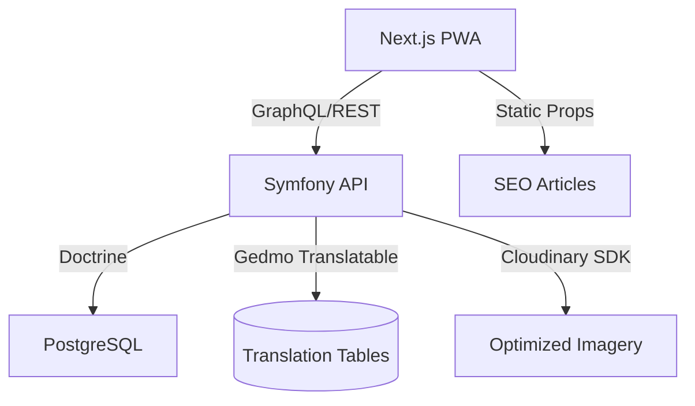
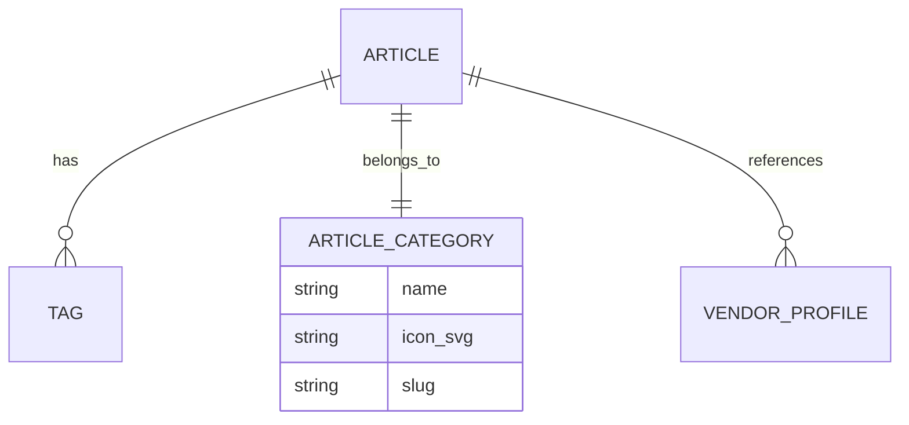

# Farah Magazine — Product Requirements Document

> **Version:** 1.0
> **Date:** 2026-04-20
> **Author:** Antigravity (Powered by PRD Architect Skill)
> **Status:** Draft — Pending Client Review
> **Confidentiality:** Farah.ma — Confidential

---

## Table of Contents

1. [Executive Summary](#1-executive-summary)
2. [Problem Statement & Goals](#2-problem-statement--goals)
3. [User Personas & Stories](#3-user-personas--stories)
4. [Technical Architecture](#4-technical-architecture)
5. [UX/UI Specifications (Airbnb Inspired)](#5-uxui-specifications)
6. [Success Metrics & Analytics](#6-success-metrics--analytics)
7. [Timeline & Milestones](#7-timeline--milestones)
8. [Resource Requirements](#8-resource-requirements)
9. [Open Questions & Assumptions](#9-open-questions--assumptions)
10. [Appendices](#10-appendices)

---

## 1. Executive Summary

Farah Magazine is the content-driven engine of the Farah.ma platform. It aims to transform the platform from a utility-based vendor directory into a high-engagement wedding planning lifestyle destination. By combining deep Moroccan cultural planning advice (inspired by **The Knot**) with an industry-leading, minimalist user interface (inspired by **Airbnb**), Farah Magazine will become the primary organic entry point for modern Moroccan couples.

The project involves implementing a high-end content delivery system, interactive planning widgets (Calculators, Style Quizzes), and a "Real Weddings" narrative engine that directly links editorial content to the Farah vendor marketplace.

**Primary Success Metric:** 10% Click-Through Rate (CTR) from Magazine articles to verified Vendor Profiles.

---

## 2. Problem Statement & Goals

### 2.1 Problem Statement
Currently, Moroccan couples plan their weddings in a fragmented information landscape. While high-utility tools exist, there is no single source of both **cultural advice** and **marketplace integration**. Couples spend hours cross-referencing Instagram stories for "Real Wedding" inspiration with WhatsApp for vendor availability. This fragmentation leads to decision fatigue and missed connections between quality vendors and ready-to-book couples.

### 2.2 Goals & Objectives

| # | Objective | Key Result | Baseline | Target | Timeline |
|---|-----------|------------|----------|--------|----------|
| G1 | Increase organic discovery | Monthly Organic Search Sessions | 0 | 15,000 | 6 Months Post-Launch |
| G2 | Deepen platform engagement | Average Time on Magazine Page | 0s | > 4.5 Minutes | Launch + 3 Months |
| G3 | Drive vendor bookings | Lead generation from Magazine via "Shop the Look" | 0 | 500 Leads/mo | Launch + 6 Months |
| G4 | Establish brand authority | "Vibe Quiz" completion rate | 0% | > 25% of visitors | Launch + 1 Month |

### 2.3 Non-Goals
- **In-House Editorial Team**: Farah.ma will not hire full-time writers for V1; content will be sourced from guest planners and AI-assisted drafts.
- **Video Hosting**: We will leverage Cloudinary or YouTube embeds rather than building a custom video player.
- **Comment Moderation System**: Real-time commenting is deferred to V2 to avoid moderation overhead.

---

## 3. User Personas & Stories

### 3.1 User Personas

**Persona: Nadia — The Modern Planner**
- **Demographics:** 26, Casablanca, Digital Native.
- **Goals:** Find a balance between traditional Moroccan "Fouassi" heritage and modern "Boho" aesthetics.
- **Pain Points:** Overwhelmed by generic advice that doesn't account for specific Moroccan logistics (e.g., Négafa timing).
- **Technical Proficiency:** High.

### 3.2 User Stories & Requirements

#### Epic 5: Advice & Magazine (The "Magazine")

**US-5.1: The Iconic Category Bar**
> As Nadia, I want a clean, horizontal way to filter articles by category (Tradition, Fashion, Budget) so I can quickly find what matters to my current stage.

**Acceptance Criteria:**
- [ ] Sticky horizontal scroll bar with custom minimalist line icons for each category.
- [ ] Active category is visually distinct using the Terracotta (#E8472A) accent.
- [ ] Transition between categories is smooth with no full-page reload (TanStack Query caching).

**US-5.2: The "Hamlou" (Tea) Calculator Widget**
> As Nadia, I want an interactive catering calculator inside articles so I can estimate exact quantities of mint tea and Gâteaux Marocains for my guest count.

**Acceptance Criteria:**
- [ ] Embedded widget that takes "Guest Count" as input.
- [ ] Outputs recommended quantities (Liters of tea, KG of pastries) based on validated vendor standards.
- [ ] CTA beneath the result links to the "Caterers" category in the Vendor Directory.

---

## 4. Technical Architecture

### 4.1 System Overview
The Magazine leverages the existing **Decoupled Symfony + Next.js** stack. The `Article` entity in Symfony is the source of truth, enriched with JSON-LD metadata for SEO.

### 4.2 Component Architecture (Frontend)
- **ArticlePage (SSR)**: Optimized for SEO via `getStaticProps` with on-demand revalidation.
- **MagazineCategoryBar**: Reusable component using Framer Motion for smooth pill transitions.
- **HireTheProsWidget**: Floating sticky component that fetches vendors based on article tags.

### 4.3 Data Model
We will extend the existing `Article` and `ArticleCategory` entities.

---

## 5. UX/UI Specifications (Airbnb Inspired)

### 5.1 User Flows
**Flow: Inspiration to Booking**
1. User lands on `/magazine` (SEO or Social).
2. User scrolls the **Airbnb Category Bar** to "Caftan Trends".
3. User opens article: "Choosing the Perfect R’anda".
4. User scrolls 50%: **Floating Action Card** appears: "Need a Négafa in Marrakech? [Top Rated Pros]".
5. User clicks → Directed to pre-filtered Vendor Directory.

### 5.2 Wireframe Descriptions
- **Magazine Landing (`/magazine`)**: Large featured hero (70vh) with immersive parallax. Below it, the iconic scrollable category bar.
- **Article Detail**: 800px max-width central column for readability. Large immersive headers. 

---

## 6. Success Metrics & Analytics

| KPI | Definition | Baseline | Target | Tool |
|-----|-----------|----------|--------|------|
| Article Completion Rate | % of users reaching the end of an article | 0% | 40% | GA4 |
| Widget Engagement | Users interacting with catering/budget calculators | 0 | 15% of sessions | Hotjar |
| Referral Value | Tracked leads sent to vendors from magazine | 0 | 2.5 leads/article | GA4 + API |

---

## 7. Timeline & Milestones

| Phase | Description | Duration | Key Deliverables |
|-------|-------------|----------|-----------------|
| P5.1 | Infrastructure & Entities | 1 Week | API support for widgets & tags |
| P5.2 | Frontend Layouts | 2 Weeks | Category bar + Article detail pages |
| P5.3 | Interactive Widgets | 2 Weeks | Catering & Budget mini-tools |
| P5.4 | Content Seeding | 1 Week | 15 high-quality "Anchor Articles" |

---

## 8. Open Questions & Assumptions

### 8.1 Open Questions
- **Q1**: Should users be able to "Save" specific paragraphs to their moodboard? [Requires deeper DB changes — P1]
- **Q2**: How should the layout handle mixed RTL (Arabic) and LTR (French) sentences in the same article?

### 8.2 Assumptions
- **A1**: High-quality imagery will be provided by partner vendors.
- **A2**: Users prefer WhatsApp links over in-magazine contact forms for quick advice questions.

---

## 10. Appendices

### Appendix A: Glossary
- **Hamlou**: Specifically used here to refer to the catering quantity standards.
- **R’anda**: Traditional Moroccan hand-embroidery style.
- **Airbnb Category Bar**: Reference to the scrollable pill navigation with icons.
