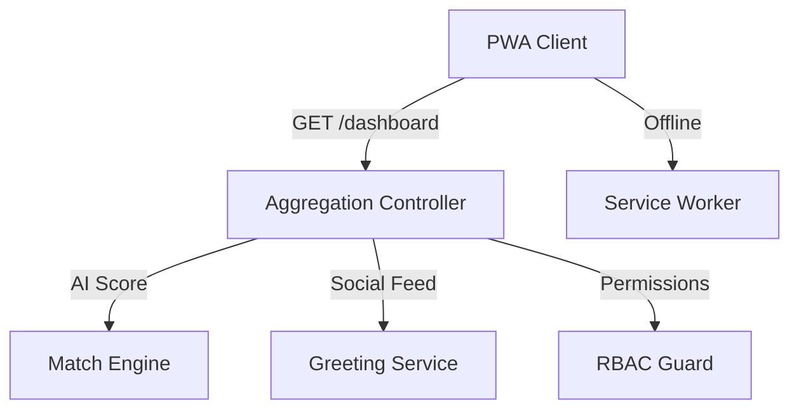

# Couple Planner Dashboard — Product Requirements Document (Epic 6)

> **Version:** 2.0 (The Ultimate "Vision" Edition)
> **Date:** 2026-04-20
> **Author:** Antigravity (Powered by PRD Architect Skill)
> **Status:** Draft — Pending Client Review
> **Confidentiality:** Farah.ma — Confidential

---

## Table of Contents

1. [Executive Summary](#1-executive-summary)
2. [Problem Statement & Goals](#2-problem-statement--goals)
3. [User Personas & Stories](#3-user-personas--stories)
4. [Technical Architecture](#4-technical-architecture)
5. [UX/UI Specifications (The Knot & Airbnb Fusion)](#5-uxui-specifications)
6. [Success Metrics & Analytics](#6-success-metrics--analytics)
7. [Timeline & Milestones](#7-timeline--milestones)
8. [Resource Requirements](#8-resource-requirements)
9. [Open Questions & Assumptions](#9-open-questions--assumptions)
10. [Appendices](#10-appendices)

---

## 1. Executive Summary

The **Couple Planner Dashboard** is the mission-control center for the Farah.ma couple experience. It serves as the single point of entry for all planning tools while providing an emotionally resonant, personalized overview of the wedding journey. 

This ultimate version (v2.0) positions Farah.ma as a pioneer in **collaborative AI-driven planning**. It seamlessly blends standard utility with **Social Pulse (Wall of Love)**, **AI-Matchmaking (Consensus Match)**, and **Traditional Respect (Family Elder Mode)**, creating an experience that is both state-of-the-art and deeply rooted in Moroccan family values.

---

## 2. Problem Statement & Goals

### 2.2 Goals & Objectives (Ultimate v2.0 Additions)

| # | Objective | Key Result | Baseline | Target | Timeline |
|---|-----------|------------|----------|--------|----------|
| G8 | Reduce Decision Friction | % of vendors booked via **Consensus Match** | 0% | > 40% | Launch + 6 Mo |
| G9 | Boost Guest Excitement | Submissions to the **Wall of Love** per guest | 0 | > 1.2 | Launch + 1 Mo |
| G10 | Family Inclusion | Active **Elder Mode** users per wedding | 0 | > 2 | Launch + 1 Mo |

---

## 3. User Personas & Stories

### 3.2 User Stories & Requirements (The "Ultimate" Features)

#### [The Social & Collaborative Hub]
**US-6.14: The 'Consensus Match' (AI Shared Vision)**
- [ ] AI analyzes both partners' styles and likes to generate a unified **Consensus Match Score** on vendor profiles.
- [ ] "Golden Match" highlights vendors who satisfy both partners' preferences.

**US-6.15: The 'Wall of Love' (Live RSVP Pulse)**
- [ ] A horizontally scrollable widget showing live RSVP greeting notes and photos from guests.
- [ ] Interactive "Pulse" (like/heart) for the couple to acknowledge well-wishes.

**US-6.16: 'Family Elder' Access (Delegated Roles)**
- [ ] Specialized "Elder Mode" with high-contrast UI and read-only access to Guest List & Gift Ledger.
- [ ] Hides complex task lists and budget details to maintain elder-friendly simplicity.

#### [Existing Advanced Features Recap]
- **US-6.4: Zghrouta Meter** (Gamification).
- **US-6.5: Shared Pulse Feed** (Activity tracking).
- **US-6.11: Wedding Day "Live Mode"** (Mission control).
- **US-6.8: Haq & Haq Budget Splitter** (Traditional finance).
- **US-6.13: Gift & Envelope Tracker** (The Ghrad Ledger).

---

## 4. Technical Architecture

### 4.1 System Overview (v2.0 Enhancements)
- **AI Engine**: A lightweight collaborative filtering service to calculate Match Scores.
- **RBAC**: Enhanced Role-Based Access Control to support the "Elder" role.
- **Social Storage**: NoSQL or optimized JSON storage for "Wall of Love" greetings.

---

## 5. UX/UI Specifications

### 5.1 Design Philosophy
- **"Floating Action Pills"**: For real-time indicators like Consensus Scores.
- **Glassmorphism Greeting Cards**: Minimalist, elegant cards for the Wall of Love.
- **High-Contrast "Elder Mode"**: Specifically optimized for older users (large fonts, clear CTAs).

---

## 10. Appendices
- Reference: Netflix "Match Score" logic adapted for services.
- Reference: Airbnb "Guest Manual" simplified view.
