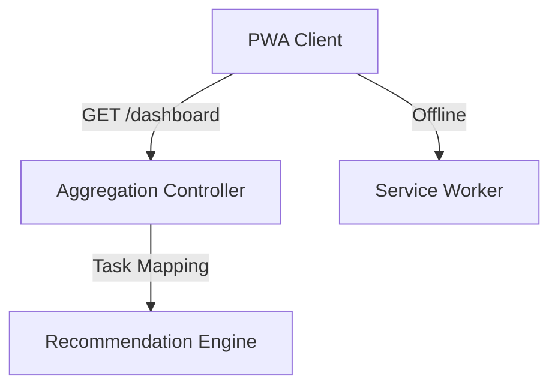

# Couple Planner Dashboard — Product Requirements Document (Epic 6)

> **Version:** 2.0 (The Ultimate "Vision" Edition)
> **Date:** 2026-04-20
> **Author:** Antigravity (Powered by PRD Architect Skill)
> **Status:** Draft — Pending Client Review
> **Confidentiality:** Farah.ma — Confidential

---

## Table of Contents

1. [Executive Summary](#1-executive-summary)
2. [Problem Statement & Goals](#2-problem-statement--goals)
3. [User Personas & Stories](#3-user-personas--stories)
4. [Technical Architecture](#4-technical-architecture)
5. [UX/UI Specifications (The Knot & Airbnb Fusion)](#5-uxui-specifications)
6. [Success Metrics & Analytics](#6-success-metrics--analytics)
7. [Timeline & Milestones](#7-timeline--milestones)
8. [Resource Requirements](#8-resource-requirements)
9. [Open Questions & Assumptions](#9-open-questions--assumptions)
10. [Appendices](#10-appendices)

---

## 1. Executive Summary

The **Couple Planner Dashboard** is the mission-control center for the Farah.ma couple experience. It serves as the single point of entry for all planning tools while providing an emotionally resonant, personalized overview of the wedding journey. 

This simplified version focuses on **actionable planning** and **clear progress tracking**. It seamlessly blends standard utility with a **Progress Timeline**, creating an experience that is both highly effective and deeply rooted in Moroccan family values.

---

## 2. Problem Statement & Goals

### 2.2 Goals & Objectives (Ultimate v2.0 Additions)

| # | Objective | Key Result | Baseline | Target | Timeline |
|---|-----------|------------|----------|--------|----------|
| G8 | Guide Next Steps | % of unfinished tasks clicked through to vendors | 0% | > 40% | Launch + 6 Mo |

---

## 3. User Personas & Stories

### 3.2 User Stories & Requirements (The "Ultimate" Features)

#### [The Social & Collaborative Hub]
**US-6.14: The 'Progress Timeline' (Actionable Planning)**
- [ ] A vertical or horizontal timeline tracking upcoming and overdue milestones.
- [ ] Automatically associates unfinished tasks (e.g., "Book Caterer") with their relevant vendor category.
- [ ] Provides one-click "Find Vendors" buttons to guide couples to the vendor directory directly from the dashboard.

#### [Existing Advanced Features Recap]
- **US-6.5: Shared Pulse Feed** (Activity tracking).
- **US-6.11: Wedding Day "Live Mode"** (Mission control).
- **US-6.8: Haq & Haq Budget Splitter** (Traditional finance).
- **US-6.13: Gift & Envelope Tracker** (The Ghrad Ledger).

---

## 4. Technical Architecture

### 4.1 System Overview (v2.0 Enhancements)
- **Recommendation Engine**: A lightweight mapping of checklist tasks to vendor categories to provide context-aware suggestions.

---

## 5. UX/UI Specifications

### 5.1 Design Philosophy
- **Action-Oriented Timeline**: Prominent layout for next steps to minimize decision fatigue.

---

## 10. Appendices
- Reference: Asana "My Tasks" view adapted for event planning.
- Reference: Airbnb "Guest Manual" simplified view.
