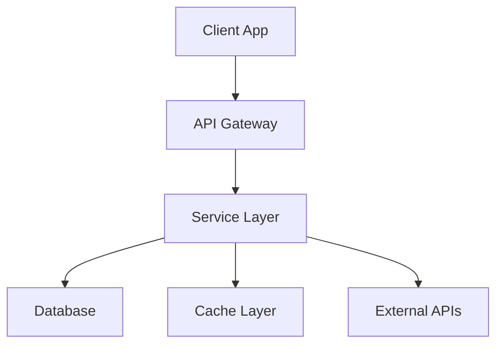
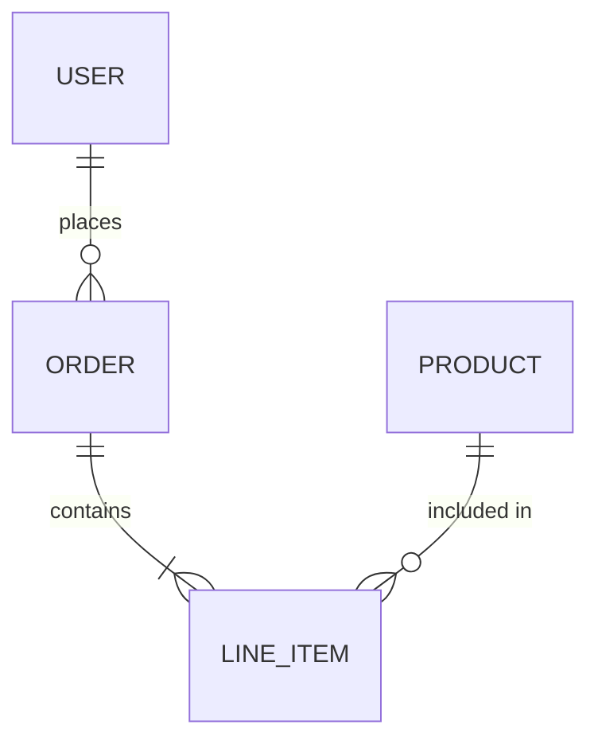
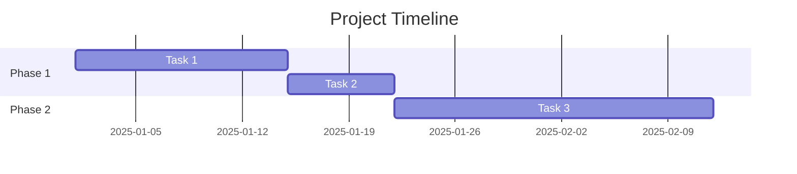

# PRD Template Reference

Use this template as the structural backbone for every PRD. Adapt section depth based on input complexity — a simple feature might have a lighter Technical Architecture section than a full platform build, but never skip sections entirely. Omitting a section signals to the client that it wasn't considered.

---

## Document Structure

```markdown
# [Product/Feature Name] — Product Requirements Document

> **Version:** 1.0
> **Date:** [YYYY-MM-DD]
> **Author:** [Team/Company Name]
> **Status:** Draft — Pending Client Review
> **Confidentiality:** [Client Name] — Confidential

---

## Table of Contents

[Auto-generate from headings. Number all sections.]

---

## 1. Executive Summary

[2-3 paragraphs max. This is the "elevator pitch" of the entire document.
Cover: What is being built, why it matters, who it's for, and the expected
business impact. A busy executive should be able to read only this section
and understand the full picture.

End with a single sentence stating the primary success metric.]

---

## 2. Problem Statement & Goals

### 2.1 Problem Statement

[Describe the problem from the user's perspective. Use concrete scenarios.
Quantify the pain if possible: "Users currently spend an average of 12 minutes
completing a process that should take 2 minutes."]

### 2.2 Goals & Objectives

[List 3-5 goals using the OKR format:]

| # | Objective | Key Result | Baseline | Target | Timeline |
|---|-----------|------------|----------|--------|----------|
| G1 | [Objective] | [Measurable KR] | [Current] | [Goal] | [When] |
| G2 | ... | ... | ... | ... | ... |

### 2.3 Non-Goals (Explicit Scope Boundaries)

[List what this project intentionally does NOT address. This prevents scope
creep and sets clear expectations with the client. Be specific — "Performance
optimization of the legacy system" is better than "Other stuff".]

---

## 3. User Personas & Stories

### 3.1 User Personas

[For each persona, include:]

**Persona: [Name — Role]**
- **Demographics:** [Relevant characteristics]
- **Goals:** [What they want to achieve]
- **Pain Points:** [Current frustrations]
- **Technical Proficiency:** [Low / Medium / High]

### 3.2 User Stories & Requirements

[Number every requirement. Use the standard format with acceptance criteria.]

#### Epic 1: [Epic Name]

**US-1.1: [Story Title]**
> As a [persona], I want to [action] so that [benefit].

| Priority | Effort Estimate | Dependencies |
|----------|----------------|--------------|
| P0 — Must Have | [S/M/L/XL] | [List any] |

**Acceptance Criteria:**
- [ ] [Specific, testable criterion]
- [ ] [Another criterion]
- [ ] [Edge case handling]

[Repeat for each user story, grouped by epic]

### 3.3 Requirements Traceability Matrix

| Req ID | Description | Goal | Priority | Status |
|--------|-------------|------|----------|--------|
| US-1.1 | [Short desc] | G1 | P0 | Proposed |
| US-1.2 | ... | ... | ... | ... |

---

## 4. Technical Architecture

[This is the most critical section. It should demonstrate technical depth
and give the engineering team a clear blueprint.]

### 4.1 System Overview

[High-level description of the system architecture. Include a Mermaid diagram:]



[Explain the diagram. Cover the architectural pattern chosen (monolith,
microservices, serverless, etc.) and why.]

### 4.2 Component Architecture

[Break down each major component:]

**Component: [Name]**
- **Responsibility:** [What it does]
- **Technology:** [Stack/framework]
- **Interfaces:** [APIs it exposes or consumes]
- **Data Store:** [What data it owns]
- **Scaling Strategy:** [How it handles load]

### 4.3 Data Model

[Include entity relationships. Use a Mermaid ER diagram or table format:]



[Describe key entities, their attributes, and relationships. Note any
data migration requirements from existing systems.]

### 4.4 API Design

[Define key API endpoints:]

| Method | Endpoint | Description | Auth |
|--------|----------|-------------|------|
| POST | /api/v1/resource | Create resource | Bearer Token |
| GET | /api/v1/resource/:id | Get resource | Bearer Token |

[Include request/response schemas for critical endpoints.]

### 4.5 Integration Points

[List all external systems this interacts with:]

| System | Integration Type | Protocol | Data Flow |
|--------|-----------------|----------|-----------|
| [System Name] | [API/Webhook/DB] | [REST/gRPC/etc.] | [In/Out/Bidirectional] |

### 4.6 Infrastructure & Deployment

- **Hosting:** [Cloud provider, region strategy]
- **CI/CD:** [Pipeline description]
- **Environments:** [Dev → Staging → Production]
- **Monitoring:** [Observability stack]
- **Disaster Recovery:** [RPO/RTO targets, backup strategy]

### 4.7 Security Considerations

- **Authentication:** [Method and provider]
- **Authorization:** [RBAC/ABAC model]
- **Data Protection:** [Encryption at rest/in transit, PII handling]
- **Compliance:** [GDPR, HIPAA, SOC2, etc. — as applicable]

### 4.8 Performance Requirements

| Metric | Target | Measurement Method |
|--------|--------|--------------------|
| API Response Time (p95) | < 200ms | APM monitoring |
| Page Load Time | < 2s | Lighthouse / RUM |
| Concurrent Users | [N] | Load testing |
| Uptime SLA | 99.9% | Monitoring |

---

## 5. UX/UI Specifications

### 5.1 User Flows

[Describe the primary user journeys. Use Mermaid flowcharts for complex flows.]

### 5.2 Wireframe Descriptions

[If no visual wireframes are available, describe each key screen:]

**Screen: [Name]**
- **Purpose:** [What the user accomplishes here]
- **Key Elements:** [List major UI components]
- **Actions Available:** [What the user can do]
- **Navigation:** [Where they came from, where they can go]

### 5.3 Accessibility Requirements

- WCAG 2.1 AA compliance minimum
- Screen reader compatibility
- Keyboard navigation support
- [Additional requirements as applicable]

---

## 6. Success Metrics & Analytics

### 6.1 Key Performance Indicators

| KPI | Definition | Baseline | Target | Measurement Tool |
|-----|-----------|----------|--------|-----------------|
| [KPI Name] | [How it's calculated] | [Current] | [Goal] | [Analytics tool] |

### 6.2 Analytics Implementation

[Describe the key events to track and the analytics infrastructure.]

### 6.3 Success Criteria for Launch

[Define the go/no-go criteria. What must be true for launch to proceed?]

---

## 7. Timeline & Milestones

### 7.1 Phase Overview

| Phase | Description | Duration | Key Deliverables |
|-------|-------------|----------|-----------------|
| Phase 1 — Foundation | [Scope] | [Weeks] | [Deliverables] |
| Phase 2 — Core Features | [Scope] | [Weeks] | [Deliverables] |
| Phase 3 — Polish & Launch | [Scope] | [Weeks] | [Deliverables] |

### 7.2 Milestone Schedule



### 7.3 Dependencies & Risks

| Risk | Probability | Impact | Mitigation |
|------|------------|--------|------------|
| [Risk description] | High/Med/Low | High/Med/Low | [Strategy] |

---

## 8. Resource Requirements

### 8.1 Team Composition

| Role | Count | Responsibilities | Duration |
|------|-------|-----------------|----------|
| [Role] | [N] | [Key duties] | [Phase X-Y] |

### 8.2 Infrastructure Costs (Estimated)

| Resource | Monthly Cost | Notes |
|----------|-------------|-------|
| [Resource] | [Cost] | [Details] |

---

## 9. Open Questions & Assumptions

### 9.1 Open Questions

| # | Question | Owner | Due Date | Impact if Unresolved |
|---|----------|-------|----------|---------------------|
| Q1 | [Question] | [Who decides] | [When] | [What gets blocked] |

### 9.2 Assumptions

| # | Assumption | Risk if Wrong | Validation Plan |
|---|-----------|---------------|-----------------|
| A1 | [Assumption] | [Consequence] | [How to verify] |

---

## 10. Appendices

### Appendix A: Glossary

| Term | Definition |
|------|-----------|
| [Term] | [Definition] |

### Appendix B: References

- [Link or document reference]

### Appendix C: Change Log

| Version | Date | Author | Changes |
|---------|------|--------|---------|
| 1.0 | [Date] | [Author] | Initial draft |
```

---

## Section Depth Guidelines

Adjust the depth of each section based on the project complexity:

| Section | Simple Feature | Medium Project | Platform Build |
|---------|---------------|----------------|----------------|
| Executive Summary | 1 paragraph | 2 paragraphs | 3 paragraphs |
| Problem & Goals | 2-3 goals | 3-5 goals | 5-7 goals with sub-KRs |
| User Stories | 3-5 stories | 8-15 stories | 15-30+ grouped by epic |
| Technical Architecture | High-level only | Component + API detail | Full depth all subsections |
| Timeline | Single phase | 2-3 phases | 3-5 phases with Gantt |
| Open Questions | 2-3 items | 5-8 items | 8-15 items |

## Writing Style Guide

- **Tone:** Professional, confident, precise. No hedging language ("maybe", "possibly", "we think"). Use "will" not "would".
- **Voice:** Active voice. "The system processes requests" not "Requests are processed by the system."
- **Numbers:** Always quantify. "Improves performance" → "Reduces latency by 40%."
- **Jargon:** Use technical terms where appropriate but define them in the glossary if the client audience includes non-technical stakeholders.
- **Formatting:** Consistent heading hierarchy, numbered requirements, tables for structured data.
